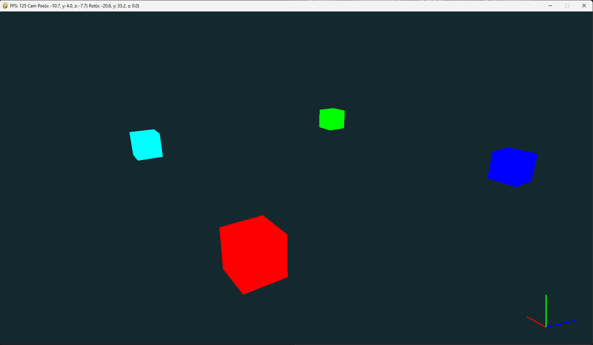

# 3D-Editor

**Автор:** Голик Тимофей

**Описание:** Простой 3д редактор с возможность отрисовки геометрии и последующего сохранения

## Использование
Сначала нужно установить все модули из `requirements.txt`

```
pip install -r requirements.txt
```

Затем запускаем приложение

```
python Scripts/Source/General/main.py
```

#### Замечание

Пытался запустить на linux, но никак не мог скачать библиотеку PyGLM, поэтому без тестов(

### Ключи для запуска отсутсвуют 


#### Скриншот


