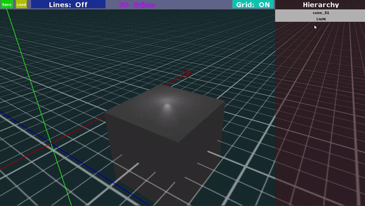

# 3D-Editor


**Описание:** Простой 3д редактор с возможность отрисовки геометрии и последующего сохранения

## Особенности

- Полностью кастомный GUI
- Сечение объектов плоскостью
- Сечение плоскости объектами
- Свободная камера
- Система компонентов
- Перемещение источника света

## Использование

Сначала нужно установить все модули из `requirements.txt`

```
pip install -r requirements.txt
```

Затем запускаем приложение

```
python Scripts/Source/General/editor.py
```

## Управление

### Перемещение

- **W, A, S, D** — перемещение в плоскости камеры
- **Q, E** — поднять, опустить камеру над плоскостью
- **SHIFT** — зажать, для ускоренного передвижения
- **RMB**(Right Mouse Button) — зажать, для вращения камерой

### Интерфейс

- **LMB**(Left Mouse Button) — выбрать объект
- **LMB** на ось перемешения — Переместить выбранный объект
- 
- **RMB** на панели Hierarchy — Открыть контекстное меню

- **SHIFT + LMB** — выбор нескольких элементов


### Другое

- SHIFT + G — Отключить/Включить GUI. Работает при включенной английской расскладке

#### Замечание

Пытался запустить на linux, но никак не мог скачать библиотеку PyGLM, поэтому без тестов(

### Запуск через консоль

- Запуск программы на вступительной сцене
  ```cmd
  python Scripts/Source/General/editor.py
  ```
- Запуск программы с загрузкой определенной сцены
  ```cmd
  python ./Scripts/Source/General/editor.py -l .\Scenes\scene0.json
  ```
- Создание новой сцены
  ```cmd
  python ./Scripts/Source/General/editor.py -l .\Scenes\new_scene.json
  ```

### Ключи

- `-h`, `--help`           — помощь
- `-l LOAD`, `--load LOAD` — относительный путь до файла загрузки сцены

#### Скриншот


